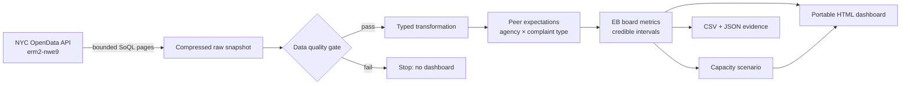

# HizmetNabiz

[](https://github.com/onurozaydin/hizmet-nabiz/actions/workflows/quality.yml)
[](https://www.python.org/)
[](LICENSE)

**Decision-grade service equity and backlog intelligence for NYC 311 operations.**

HizmetNabiz turns a fixed, reproducible extract of official NYC 311 requests into a
portable operations dashboard. It answers a harder question than “which district is
slowest?”: **where is delay persistently worse after accounting for case mix, sample size,
and addressable workload?**

> This is an independent portfolio project. It is not affiliated with or endorsed by the
> City of New York. Results are observational and must not be interpreted as causal agency
> evaluations.

## The decision and target user

The primary user is a municipal operations analyst deciding where to spend limited process-
improvement or case-review capacity. Raw averages are a poor basis for that decision because
agencies and districts handle different problem types, a few extreme cases distort means, and
small districts can jump to the top of a ranking by chance.

HizmetNabiz provides:

- a validated KPI contract for workload, closure, tail latency, and due-date performance;
- complaint/agency-mix-adjusted delay at Community Board level;
- reliability-aware high-delay estimates with 90% credible intervals;
- a transparent, bounded “what-if” capacity allocation scenario; and
- a self-contained HTML dashboard that works without a server or external JavaScript CDN.

## Why this is different

A public GitHub review found many NYC 311 tutorials centred on complaint counts, raw average
resolution time, maps, or generic Power BI/Streamlit views. HizmetNabiz adds four concrete
capabilities:

1. **Case-mix adjustment.** Each closed request is compared with the median for its own
   agency × complaint-type peer group; sparse peers fall back to complaint-level expectations.
2. **Reliability-aware ranking.** Empirical-Bayes shrinkage and 90% intervals prevent small,
   noisy districts from dominating a league table.
3. **Decision linkage.** The priority score combines reliability-adjusted delay, peer-relative
   delay, and addressable volume; the scenario engine applies an explicit capacity budget and
   per-district concentration cap.
4. **Auditability.** The API query, retrieval timestamp, compressed-file SHA-256, blocking data
   checks, metric definitions, tests, and generated outputs are all reproducible.

See [the competitive review](docs/competitive_review.md) for the projects inspected and the
specific gap this repository addresses.

## Verified snapshot

The committed analytical outputs are generated from NYC OpenData dataset `erm2-nwe9`, using
requests created from **2025-01-01 00:00:00 through 2025-01-08 00:00:00 (exclusive)**. The raw
snapshot is intentionally not committed. Its compact `data/raw/manifest.json` is committed so the
exact retrieval timestamp, query, row count, and compressed-file hash remain auditable. Run
`hizmet-nabiz fetch` to create a fresh snapshot and manifest.

The verified run produced:

- **90,565** unique requests and **0** duplicate keys; all five blocking source-quality checks
  passed.
- **99.30%** closed-date coverage, **11.47 h** median resolution, and **233.86 h** P90 tail
  resolution across valid closed requests.
- **59** decision-eligible Community Boards. `15 BROOKLYN` ranked first on the explicit triage
  index, with a **1.45x** peer-adjusted delay index and **38.2%** EB high-delay rate
  (90% interval: **35.8%–40.5%**). This is an investigation signal, not a causal fairness claim.
- Due dates covered only **0.34%** (308 requests), so the on-time headline was automatically
  suppressed rather than generalized to the full cohort.
- A bounded 500-case scenario allocated 125 cases each to four boards. Its arithmetic
  **27,912-hour** result depends entirely on the stated 25% assumption and is not a forecast.

Exact quality results and KPI values are recorded in:

- `data/processed/analysis_summary.json`
- `data/processed/quality_report.json`
- `reports/validation_report.md`
- `dashboard/index.html`

No synthetic data is used for the published analysis. Tests use a clearly labelled deterministic
synthetic fixture and never feed the dashboard or reported findings.

## Architecture



The raw layer keeps only non-address fields needed for analysis. The transformation layer does
not impute missing closure outcomes. Negative durations are quarantined from latency metrics.
All displayed district KPIs come from one reusable board-level model, so cards, tables, and
exports reconcile.

## Quick start

Prerequisites: Python 3.11 or 3.12 and internet access for the official data pull.

```bash
git clone https://github.com/onurozaydin/hizmet-nabiz.git
cd hizmet-nabiz
python -m venv .venv
source .venv/bin/activate
python -m pip install -e '.[dev]'
hizmet-nabiz all
```

Open `dashboard/index.html` in a modern browser. The dashboard is a self-contained file; no
database or local web server is required.

Run the quality gate:

```bash
ruff check .
ruff format --check .
mypy src
pytest
```

Run only the extraction or reuse an existing snapshot:

```bash
hizmet-nabiz fetch
hizmet-nabiz build --input data/raw/requests.csv.gz
```

An unauthenticated Socrata request is sufficient for this bounded extract. For heavier use,
obtain an app token and adapt the extractor to send it as `X-App-Token`; never commit tokens.

## KPI contract

| Metric | Definition | Eligibility / denominator | Why it exists |
|---|---|---|---|
| Closed rate | Requests with a non-null `closed_date` / all requests | Entire fixed creation cohort | Snapshot completeness guardrail |
| Median resolution hours | Median(`closed_date - created_date`) | Valid, non-negative closed durations | Robust central latency |
| P90 resolution hours | 90th percentile of resolution hours | Same as median | Tail-latency guardrail |
| On-time rate | `closed_date <= due_date` | Closed requests with a due date; suppressed as a headline when coverage <10% | SLA-like outcome with coverage guardrail |
| Delay index | `exp(mean(log1p(duration) - peer median log duration))` | Valid closed durations per board | Complaint/agency-mix-adjusted comparison |
| High-delay EB | Beta-binomial posterior rate above peer Q75 | Valid closed durations per board | Noise-resistant reliability signal |
| Excess delay hours | Sum of positive duration above peer median | Valid closed durations | Workload impact, not promised savings |

Full definitions and fallbacks are in [KPI contract](docs/kpi_contract.md).

## Repository layout

```text
configs/                 Versioned source, quality, method, and scenario settings
data/processed/          Compact, committed analytical evidence
dashboard/               Self-contained interactive HTML
docs/                    Data card, KPI contract, methodology, security, limitations
notebooks/               Reproducible validation companion
reports/                 Decision-ready validation report
src/hizmet_nabiz/        Extraction, QA, transformation, metrics, scenario, rendering
tests/                   Deterministic unit and end-to-end tests
.github/workflows/       Python 3.11/3.12 quality matrix
```

## Data source, terms, and privacy

- **Source:** [NYC OpenData — 311 Service Requests from 2020 to Present](https://data.cityofnewyork.us/Social-Services/311-Service-Requests-from-2020-to-Present/erm2-nwe9/about_data)
- **Publisher/attribution:** NYC OpenData / NYC311
- **Dataset ID:** `erm2-nwe9`
- **Terms:** [NYC Open Data overview and terms](https://opendata.cityofnewyork.us/overview/)
- **Fields pulled:** service-request key, timestamps, agency, problem type, ZIP, borough,
  status, due date, Community Board, and intake channel.

The source documentation states that the dataset does not reveal personally identifying
information about the customer. This project further minimizes risk by not extracting incident
address, street, coordinates, resolution text, or free-text fields. Raw data is excluded from Git.
Derived board-level aggregates remain subject to the source terms; the MIT license covers the
repository’s original code and documentation, not third-party data.

## Statistical interpretation

- Peer adjustment reduces complaint/agency mix bias but cannot remove staffing, weather,
  severity, policy, or reporting-channel confounding.
- Empirical Bayes shrinkage stabilizes rates; it does not prove that a board is treated unfairly.
- The capacity scenario is sensitivity analysis. Its assumed 25% reduction is not an estimate
  learned from an intervention and must not be reported as forecast savings.
- Community Board request counts are not population-normalized service need. Reporting rates can
  differ by awareness, access, and channel preference.

See [methodology](docs/methodology.md), [data card](docs/data_card.md), and
[limitations](docs/limitations.md).

## License

Original code and documentation are released under the [MIT License](LICENSE). NYC OpenData
content is governed by the City’s terms linked above.
